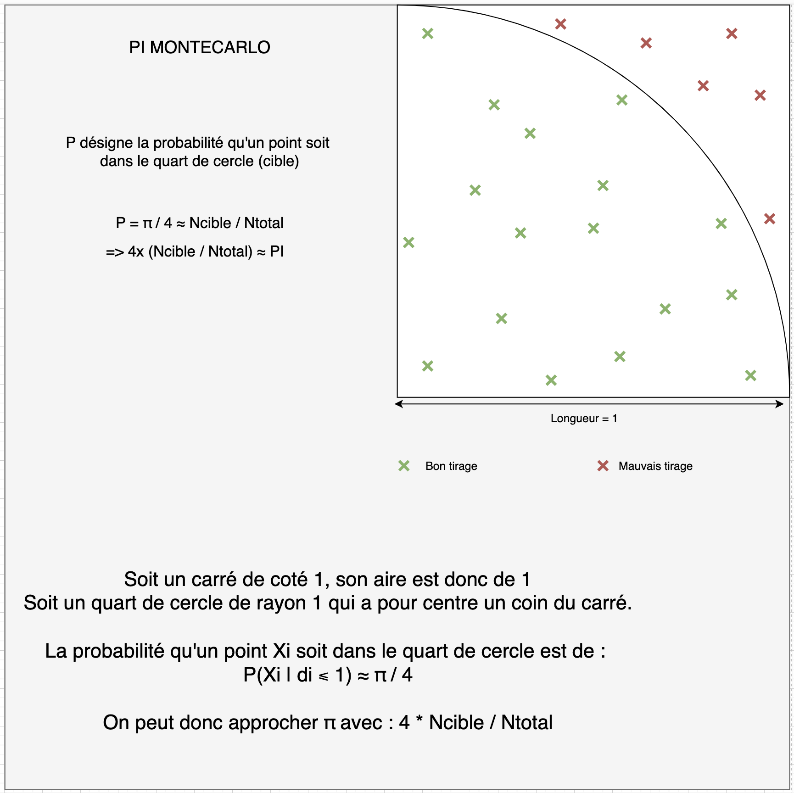

# Rapport Général

## Table des matières

- [Définitions](#définitions)
  - [Thread](#thread)
  - [Sémaphore](#sémaphore)
  - [Ressource critique](#ressource-critique)
  - [Section critique](#section-critique)
  - [Programmation parallèle](#programmation-parallèle)
  - [Programmation partagée](#programmation-partagée)
  - [Parallélisme de tâches](#parallélisme-de-tâches)
- [TP1 : Dossier de conception du TP Thread](#tp1--dossier-de-conception-du-tp-thread)
  - [Exercice 1](#exercice-1)
  - [Exercice 2](#exercice-2)
- [TP2 : Affichage synchronisé](#tp2--affichage-synchronisé)
  - [Sémaphore](#sémaphore-1)
    - [Outils de Synchronisation](#outils-de-synchronisation)
    - [Implémentation](#implémentation)
    - [Exemple : Analogie avec un Phare](#exemple--analogie-avec-un-phare)
    - [Procédé](#procédé)
    - [Conclusion](#conclusion)
- [TP3 : Boîte aux lettres](#tp3--boîte-aux-lettres)
  - [Analyse et Résolution](#analyse-et-résolution)
  - [Ce que j'ai appris](#ce-que-jai-appris)
  - [Conclusion](#conclusion)
- [TP4 (part1): Concepts avancés et Monte Carlo](#tp4--concepts-avancés-et-monte-carlo)
  - [Master / Worker](#master--worker)
  - [Future](#future)
  - [Accélération (Speedup)](#accélération-speedup)
  - [Scalabilité](#scalabilité)
  - [Méthode de Monte Carlo](#méthode-de-monte-carlo)
  - [Work Stealing Pool](#work-stealing-pool)
  - [Application de l'API Concurrent](#application-de-lapi-concurrent)
  - [Analyse des performances de Monte Carlo](#analyse-des-performances-de-monte-carlo)
- [TP4 (part2): Programmation distribuée](#programmation-distribuée)
  - [Master / Worker en distribué](#master--worker-en-distribué)
  - [Analyse des Sockets JAVA](#analyse-des-sockets-java)
    - [Analyse MasterSocket.java](#analyse-mastersocketjava)
    - [Analyse WorkerSocket.java](#analyse-workersocketjava)
  - [Monte Carlo Master/Worker Socket](#monte-carlo-masterworker-socket)
  - [Étude de la scalabilité](#étude-de-la-scalabilité)

---

## Définitions

### Thread
Un **thread** est la plus petite unité d'exécution dans un programme. Il représente un flux d'instructions qui peut s'exécuter indépendamment tout en partageant des ressources comme la mémoire et les fichiers avec d'autres threads du même processus.

### Sémaphore
Un **sémaphore** est une variable utilisée pour gérer l'accès concurrent à une ressource partagée. Il peut être binaire (1 ou 0) ou comptant (avec une valeur entière), et ses opérations principales sont :
- **`wait`** : Réduit la valeur du sémaphore et bloque si elle devient négative.
- **`signal`** : Augmente la valeur et réveille un thread bloqué si nécessaire.

### Ressource critique
Une **ressource critique** est un élément (mémoire, fichier, périphérique) partagé entre plusieurs threads ou processus, dont l'accès concurrent peut entraîner des incohérences si non contrôlé.

### Section critique
Une **section critique** est une portion du code où une ressource critique est accédée. Il est essentiel d'assurer qu'une seule entité (thread ou processus) l'exécute à la fois pour éviter des erreurs ou des incohérences.

### Programmation parallèle
La **programmation parallèle** consiste à exécuter plusieurs tâches en simultané sur des processeurs multiples, permettant d'accélérer l'exécution d'un programme en divisant les calculs ou tâches.

### Programmation partagée
La **programmation partagée** implique l'utilisation d'une mémoire unique accessible par plusieurs threads ou processus. Elle nécessite des mécanismes de synchronisation pour éviter les conflits.

### Parallélisme de tâches
Le **parallélisme de tâches** correspond à l'exécution simultanée de tâches différentes. Contrairement au parallélisme de données, chaque tâche effectue une opération distincte et indépendante.

---

## TP1 : Dossier de conception du TP Thread

### Exercice 1

**Implémentation :**
La classe `UnMobile` représente un mobile qui se déplace dans une interface graphique en utilisant un thread. Sa méthode `run()` gère le mouvement par incréments successifs, suivis de redessins avec `repaint()`.

**Ce que j'ai compris :**
Le fonctionnement d'un thread inclut :
- La gestion des boucles d'exécution (dans `run`).
- L'utilisation de `sleep` pour réguler la vitesse.
- L'importance de redessiner régulièrement les objets graphiques pour simuler le mouvement.

### Exercice 2

**Implémentation :**
Un mobile est ajouté à une fenêtre avec `add()` dans la classe `UneFenetre`, et un thread est lancé pour animer le mobile.

**Ce que j'ai appris :**
La manipulation de fenêtres avec `JFrame`, notamment :
- La gestion de la visibilité (`setVisible`).
- L'ajout de composants dynamiques (comme `UnMobile`).
- L'utilisation de threads pour animer les composants.

---

## TP2 : Affichage synchronisé

### Sémaphore

#### Outils de Synchronisation
Les sémaphores sont utilisés pour gérer l'accès sécurisé aux ressources partagées. Ils empêchent plusieurs threads d'accéder simultanément à une **section critique**, ce qui pourrait entraîner des conditions de course.

#### Implémentation

1. **Initialisation** : Choisir la valeur de départ en fonction des besoins (1 pour exclusivité, >1 pour ressources multiples).
2. **Interblocages** : Prévenir les deadlocks en respectant l'ordre des verrous.
3. **Performance** : Minimiser les sections critiques pour limiter les délais d'accès.

#### Exemple : Analogie avec un Phare
Le phare régule l'entrée des bateaux dans un port.
- **Vert (1)** : Accès autorisé à un bateau.
- **Rouge (0)** : Attente obligatoire pour les suivants.
Cela illustre les concepts de `wait` (rouge) et `signal` (vert).

#### Procédé
Un sémaphore unique contrôle l'accès au deuxième tiers d'une fenêtre, divisée en six sections. Un thread appelle `sem.syncWait()` pour entrer dans la section critique et `sem.syncSignal()` en sortant, assurant qu'un seul mobile y passe à la fois.

### Conclusion
Les sémaphores simplifient la synchronisation des threads mais nécessitent une implémentation soignée pour éviter les interblocages et préserver les performances.

---

## TP3 : Boîte aux lettres

### Analyse et Résolution

La **BAL (Boîte aux Lettres)** est une file circulaire utilisée pour un modèle producteur-consommateur. Elle s'appuie sur la classe **`BlockingQueue`** pour synchroniser automatiquement l'accès.

Dans ce TP, j’ai structuré la solution autour de la classe **BAL**, qui encapsule l’interface **`BlockingQueue`** et simplifie son utilisation. La **BAL** agit comme un point central de communication entre les threads producteurs et consommateurs. Elle masque les détails complexes de synchronisation, en utilisant une instance concrète de **`ArrayBlockingQueue`** comme tampon circulaire.

Cette organisation permet une séparation claire des responsabilités : les producteurs et consommateurs interagissent uniquement avec la **BAL** via des méthodes dédiées (deposer et retirer), tandis que la gestion des accès concurrents est entièrement confiée à l’implémentation sous-jacente de la **`BlockingQueue`**. Cette approche favorise la modularité, la lisibilité, la portabilité et la maintenance du code.

### Ce que j'ai appris :
1. **Gestion simplifiée des threads** :
   Les méthodes comme `offer` (ajout) et `poll` (retrait) évitent les blocages indéfinis.

2. **Arrêt propre** :
   Un marqueur spécial signale la fin de la production, permettant aux threads de se terminer correctement.

3. **Parallèle avec la boulangerie** :
   - **Dépôt** : Un boulanger place un pain dans un panier (lettre dans la BAL).
   - **Retrait** : Un client retire un pain, ou attend si le panier est vide.
   - **Marqueur de fermeture** : Indique la fin de l'activité.

### Conclusion

Ce TP illustre les avantages des outils de synchronisation modernes, comme **`BlockingQueue`**, pour gérer efficacement la concurrence, prévenir les blocages et simplifier le code.

---

## TP4 : Concepts avancés et Monte Carlo

### Master / Worker
Le modèle **Master/Worker** est une architecture de programmation parallèle où un **master** distribue des tâches à plusieurs **workers**. Le master coordonne les tâches et collecte les résultats, tandis que les workers exécutent les tâches en parallèle.

### Future
Un **Future** représente le résultat d'une opération asynchrone. Il permet de vérifier si le calcul est terminé et de récupérer le résultat une fois disponible.

### Accélération (Speedup)
L'**accélération** mesure le gain de performance obtenu en utilisant plusieurs processeurs par rapport à un seul. Elle est calculée comme le rapport entre le temps d'exécution séquentiel et le temps d'exécution parallèle.

### Scalabilité
La **scalabilité** est la capacité d'un système à augmenter ses performances proportionnellement à l'ajout de ressources (comme des processeurs). Elle peut être **forte** (augmentation linéaire) ou **faible** (augmentation sous-linéaire).

### Work Stealing Pool
Un **Work Stealing Pool** est une structure de données où les threads volent des tâches à d'autres threads lorsqu'ils sont inactifs, optimisant ainsi l'utilisation des ressources.

### Application de l'API Concurrent
L'API **Concurrent** de Java fournit des outils pour la programmation parallèle, comme les **Executors**, les **Futures**, et les **Concurrent Collections**, facilitant la gestion des threads et des tâches.

### Méthode de Monte Carlo
La méthode de **Monte Carlo** est une technique statistique utilisée pour estimer des résultats numériques en générant des échantillons aléatoires. Elle est souvent utilisée pour des simulations complexes.



La parallélisation par tâche est une technique utilisée pour améliorer les performances d'un programme en exécutant plusieurs tâches simultanément sur plusieurs processeurs ou cœurs. Dans le contexte de la méthode de Monte Carlo, la parallélisation par tâche peut être particulièrement efficace car cette méthode repose sur la génération d'un grand nombre d'échantillons aléatoires indépendants.

#### Explication de la Parallélisation par Tâche

1. **Décomposition en Tâches** :
   - **Tâche** : Une tâche est une unité de travail indépendante qui peut être exécutée séparément. Dans le cas de la méthode de Monte Carlo, chaque échantillon aléatoire ou groupe d'échantillons peut être considéré comme une tâche.
   - **Décomposition** : Le problème global est divisé en plusieurs tâches plus petites. Par exemple, si vous devez générer 1 000 000 d'échantillons, vous pouvez diviser ce travail en 10 tâches de 100 000 échantillons chacune.

2. **Exécution Parallèle** :
   - **Processeurs/Cœurs** : Chaque tâche est assignée à un processeur ou cœur différent pour être exécutée simultanément. Si vous avez 4 cœurs, vous pouvez exécuter 4 tâches en parallèle.
   - **Indépendance** : Les tâches doivent être indépendantes les unes des autres pour éviter les conflits d'accès aux ressources partagées. Dans la méthode de Monte Carlo, les échantillons sont généralement indépendants, ce qui facilite la parallélisation.

3. **Synchronisation et Agrégation** :
   - **Synchronisation** : Une fois que toutes les tâches sont terminées, les résultats doivent être synchronisés. Cela peut impliquer la collecte des résultats de chaque tâche et leur agrégation pour obtenir le résultat final.
   - **Agrégation** : Les résultats partiels des différentes tâches sont combinés pour obtenir le résultat global. Par exemple, si chaque tâche calcule une estimation partielle, ces estimations peuvent être moyennées pour obtenir l'estimation finale.

#### Exemple de Code Parallélisé

Voici un exemple de parallélisation par tâche pour le calcul de PI avec la méthode de Monte Carlo, utilisant l'api concurrent :

```python
import concurrent.futures
import random

def monte_carlo_task(num_samples):
    inside_circle = 0
    for _ in range(num_samples):
        x, y = random.random(), random.random()
        if x**2 + y**2 <= 1:
            inside_circle += 1
    return inside_circle

def monte_carlo_pi(num_samples, num_tasks):
    samples_per_task = num_samples // num_tasks
    with concurrent.futures.ProcessPoolExecutor() as executor:
        futures = [executor.submit(monte_carlo_task, samples_per_task) for _ in range(num_tasks)]
        inside_circle_counts = [future.result() for future in concurrent.futures.as_completed(futures)]
    total_inside_circle = sum(inside_circle_counts)
    return (total_inside_circle / num_samples) * 4
```

#### Explication de la Parallélisation
**Décomposition en Tâches :**
- La fonction monte_carlo_task représente une tâche individuelle. Elle prend un nombre d'échantillons (num_samples) et compte combien de ces échantillons tombent à l'intérieur d'un cercle unité.
- La fonction monte_carlo_pi divise le nombre total d'échantillons (num_samples) en plusieurs tâches (num_tasks). Chaque tâche traite un sous-ensemble des échantillons.

**Exécution Parallèle :**
- ProcessPoolExecutor : La bibliothèque concurrent.futures est utilisée pour créer un pool de processus (ProcessPoolExecutor). Cela permet d'exécuter plusieurs tâches en parallèle sur plusieurs processeurs ou cœurs.
- submit : La méthode executor.submit soumet chaque tâche (monte_carlo_task) au pool de processus. Chaque tâche est exécutée de manière indépendante et en parallèle.
- futures : Les objets future représentent les tâches en cours d'exécution. Ils permettent de récupérer les résultats une fois que les tâches sont terminées.

**Synchronisation et Agrégation :**
- as_completed : La méthode concurrent.futures.as_completed permet de récupérer les résultats des tâches au fur et à mesure qu'elles se terminent.
- result : La méthode future.result() récupère le résultat de chaque tâche. Les résultats sont ensuite agrégés pour obtenir le nombre total de points à l'intérieur du cercle.
- Calcul Final : Le résultat final est calculé en utilisant la formule de Monte Carlo pour estimer π.

#### Avantages de la Parallélisation par Tâche

- **Performance** : Réduit le temps d'exécution en utilisant plusieurs processeurs ou cœurs.
- **Scalabilité** : Peut être facilement adapté pour utiliser plus de ressources matérielles.
- **Simplicité** : Les tâches indépendantes sont plus faciles à gérer et à synchroniser.

#### Conclusion

La parallélisation par tâche est une technique puissante pour améliorer les performances des simulations de Monte Carlo en tirant parti des architectures multi-cœurs modernes. En décomposant le problème en tâches indépendantes et en les exécutant en parallèle, on peut obtenir des résultats plus rapidement et de manière plus efficace.


### Analyse des performances de Monte Carlo
La méthode de Monte Carlo peut bénéficier d'une bonne scalabilité grâce à son parallélisme naturel. Cependant, les limitations numériques et matérielles peuvent rapidement limiter les gains de performance.


---

## Programmation distribuée

### Master / Worker en distribué
Dans un environnement distribué, le **master** envoie des messages aux **workers** via un réseau. Les workers exécutent les tâches en parallèle et renvoient les résultats au master.

### Analyse des Sockets JAVA


#### Analyse MasterSocket.java

**Étapes principales dans le code**
**Initialisation des workers** :
- Le master demande combien de workers (processus) seront utilisés. Il ouvre un socket (canal de communication) pour chaque worker sur un port donné.
**Envoi des tâches aux workers** :
- Chaque worker reçoit le nombre total de points à générer pour l'estimation de 𝜋.

**Traitement par les workers** :
- Les workers génèrent des points aléatoires dans un carré, comptent ceux qui tombent dans un quart de cercle et renvoient leurs résultats au master.

**Récupération des résultats** :
- Le master collecte les résultats des workers via leurs sockets respectifs.
- Il combine ces résultats pour calculer la valeur approximative de 𝜋.

**Affichage des résultats** :
- Le master affiche 𝜋, l'erreur relative, et les statistiques de performance (durée, nombre de points, etc.).
- L'utilisateur peut choisir de répéter la simulation.

**Fermeture des sockets** :
- Une fois la simulation terminée, les sockets entre le master et les workers sont fermés proprement.

**Sockets :**
- **Socket côté master** : Utilisé pour envoyer des tâches et recevoir des résultats.
- **Socket côté worker (non montré ici)** : Écoute les messages du master, exécute la tâche, puis renvoie le résultat.

**Flux général de la communication**
**Master :**
- Connecte un socket pour chaque worker.
- Envoie une tâche à chaque worker via un flux d'écriture (PrintWriter).
- Lit les résultats des workers via un flux de lecture (BufferedReader).

**Workers (côté serveur, non montré ici) :**
- Écoute sur un port spécifique.
- Reçoit les données envoyées par le master.
- Effectue le calcul et renvoie le résultat.

#### Analyse WorkerSocket.java

**Étapes principales du code Worker**
**Configuration du Worker :**
- Le Worker démarre un serveur socket sur un port donné (par défaut 25545 ou spécifié en argument).
- Il attend une connexion entrante du Master via le socket.

**Communication avec le Master :**
- Une fois connecté, le Worker écoute les messages du Master en utilisant un flux d'entrée (BufferedReader).
- Après avoir reçu les données, il effectue le calcul nécessaire.

**Envoi des résultats au Master :**
- Le Worker utilise un flux de sortie (PrintWriter) pour renvoyer les résultats du calcul au Master.

**Gestion des messages et fin de tâche :**
- Si le message reçu est "END", le Worker arrête son exécution.
Sinon, il continue à traiter les données envoyées par le Master.

**Flux de communication entre Master et Worker**
**Côté Master :**
- **Client socket :** Le Master initie la connexion et envoie des tâches aux Workers. Le Master attend les réponses des Workers pour agréger les résultats.

**Côté Worker :**
- **Serveur socket :** Le Worker accepte les connexions du Master. Chaque message reçu est interprété comme une instruction (par exemple, combien de points générer pour la méthode Monte Carlo). Une fois le calcul terminé, le résultat est renvoyé au Master.

### Monte Carlo Master/Worker Socket

Pour calculer π et établir les communications Master/Worker, les changements suivants ont été apportés :
- Le **Master** distribue le nombre total de points à générer aux **Workers**.
- Chaque **Worker** génère des points aléatoires et compte ceux qui tombent dans un quart de cercle.
- Les résultats sont renvoyés au **Master**, qui les agrège pour estimer π.

### Étude de la Scalabilité

Pour étudier la scalabilité, nous avons choisi un nombre d'essais suffisamment grand pour mesurer le temps d'exécution de manière significative. Nous avons testé avec plusieurs workers et comparé les résultats.

#### Pi.java

Un script a été mis en place pour réaliser un graphique de la scalabilité forte de Pi.java, en modifiant le nombre de workers. Nous avons observé qu'au-delà de 8 cœurs, le speedup diminue en raison des limitations matérielles de la machine.

- **Parallélisation basée sur un pool de threads fixe :**
  Le programme utilise `Executors.newFixedThreadPool(numWorkers)` pour créer un pool de `numWorkers` threads, ce qui permet un contrôle efficace du parallélisme en limitant le nombre de threads actifs.

- **Répartition des tâches :**
  Chaque worker (`Callable<Long>`) exécute une fraction du nombre total d’itérations et renvoie un résultat partiel. L’agrégation des résultats se fait via `Future.get()`, qui agit comme une **barrière implicite** (les résultats sont collectés une fois que tous les threads ont terminé).

- **Avantages de cette approche :**
  - Les tâches sont bien équilibrées entre les threads (`totalCount / numWorkers` par worker).
  - L'utilisation de `invokeAll()` garantit que tous les threads travaillent en parallèle avant de récupérer les résultats.
  - Contrairement à `Assignment102.java`, le programme **réduit le nombre de tâches** en regroupant plusieurs itérations par worker, évitant ainsi la surcharge liée à la gestion d’un trop grand nombre de petites tâches.

- **Limites observées :**
  - Au-delà de 8 threads, le **speedup diminue** en raison de la saturation des ressources CPU et des coûts de synchronisation.
  - L’appel `Future.get()` bloque le thread principal jusqu'à ce que tous les workers aient terminé, ce qui peut créer un goulot d’étranglement si certains threads prennent plus de temps que d’autres.
  - L'utilisation de `Random` par chaque thread peut provoquer une contention si plusieurs threads génèrent des nombres aléatoires en parallèle.

#### Assignments102

Le script précédent a été réutilisé pour `Assignments102.java`. Ce paradigme fonctionne différemment et les mesures révèlent qu'il est moins efficace. Le speedup de la scalabilité forte du code `Assignments102` est proche de la scalabilité faible de `Pi.java`.

- **Trop de tâches créées (1 tâche par point simulé) :**
  Chaque simulation de point (x, y) est soumise individuellement au pool de threads, ce qui entraîne une surcharge importante sur le gestionnaire de tâches. La création et la gestion d'un grand nombre de threads très courts génèrent un overhead significatif et réduisent l'efficacité globale du programme.

- **Problème de synchronisation sur `AtomicInteger` :**
  L'utilisation de `AtomicInteger.incrementAndGet()` pour compter les points dans le cercle crée une contention mémoire entre threads. Chaque mise à jour étant atomique, cela ralentit l'accès concurrentiel. Une alternative plus performante serait l'utilisation de `LongAdder`, qui réduit les conflits en répartissant les mises à jour sur plusieurs variables internes.

Globalement, `Pi.java` est mieux parallélisé que `Assignment102.java`, car il minimise la surcharge de création de threads et utilise un **modèle de travail bien équilibré** pour exploiter efficacement les ressources CPU.

### Comparaison Assignment102 vs Pi

#### Différences d'erreurs
L'erreur dans l'estimation de π varie en fonction de la méthode utilisée :
- **`Assignment102`** : Chaque point généré est traité individuellement, ce qui entraîne une grande variabilité due aux fluctuations aléatoires et aux conflits d'accès sur une variable partagée. La convergence est plus lente et l'erreur plus importante.
- **`Pi.java`** : La génération de points est répartie en lots et exécutée en parallèle, réduisant l'impact des erreurs aléatoires et améliorant la stabilité de l'estimation de π.

Une analyse des résultats montre que `Pi.java` produit des valeurs plus précises avec une variance plus faible comparée à `Assignment102`.

#### Différences de paradigmes de programmation

1. **Approche `Assignment102` : Parallélisme de fine granularité**
   - Chaque point aléatoire est traité comme une tâche distincte.
   - Utilisation intensive de `AtomicInteger` pour la synchronisation, entraînant des ralentissements dus à la contention mémoire.
   - Nombre très élevé de tâches légères soumises à un gestionnaire de threads, augmentant la surcharge du système.

2. **Approche `Pi.java` : Parallélisme par regroupement de tâches**
   - Chaque thread traite un bloc d'échantillons, réduisant le nombre de tâches créées.
   - Synchronisation minimale grâce à l'agrégation locale avant soumission des résultats.
   - Utilisation optimisée des cœurs processeur avec un pool de threads équilibré.

#### Impact sur la Scalabilité
- **`Assignment102`** présente une scalabilité limitée en raison du nombre excessif de tâches et de la contention sur `AtomicInteger`.
- **`Pi.java`** est plus efficace car il minimise les conflits et optimise l'utilisation des ressources CPU.

En conclusion, la méthode `Pi.java` surpasse `Assignment102` en termes d'efficacité et de précision grâce à une meilleure gestion des tâches et une réduction des conflits d'accès concurrentiels.


TODO : faire un graphe d'erreur TP / P et scal faible assignments102