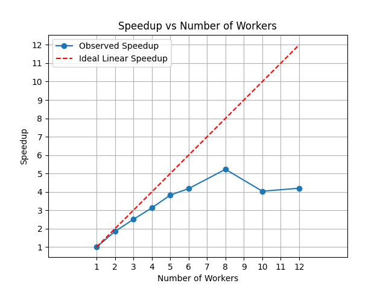
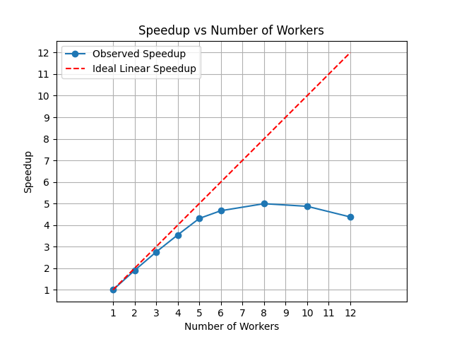
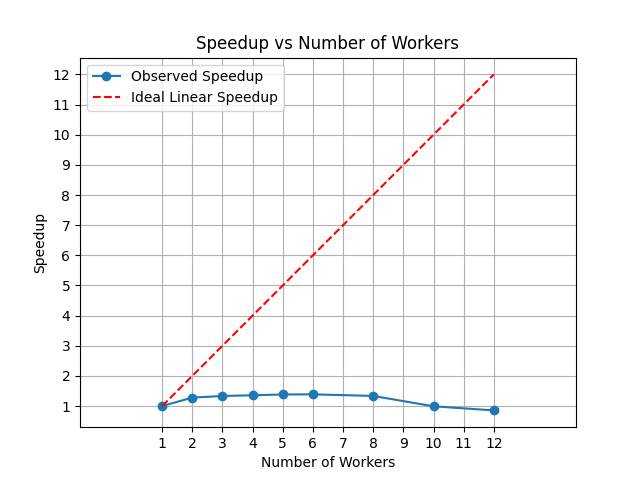
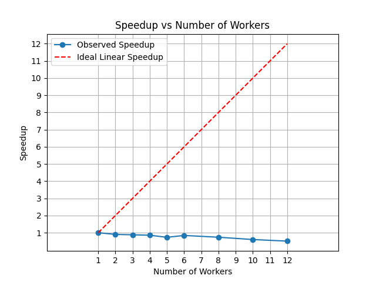
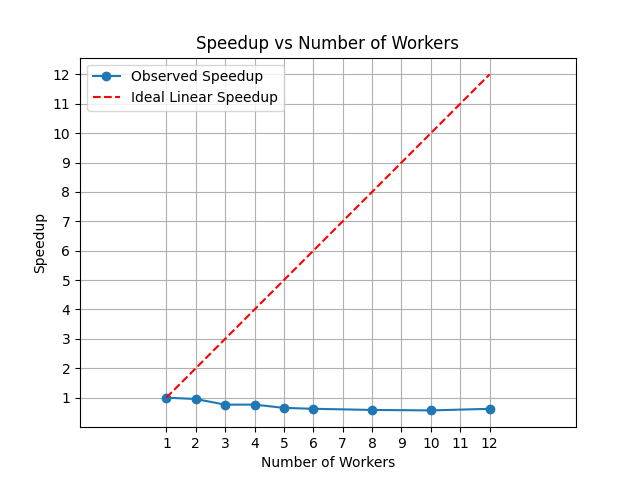
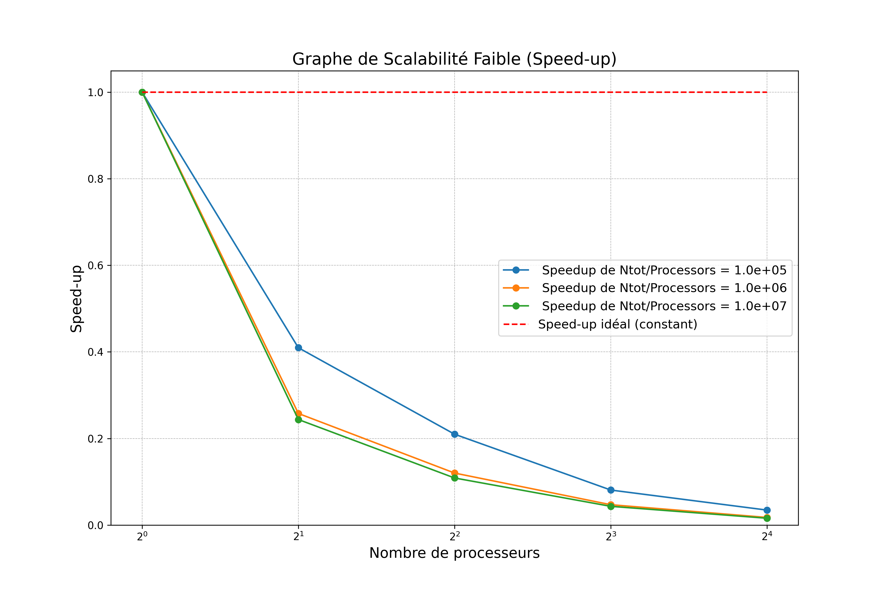
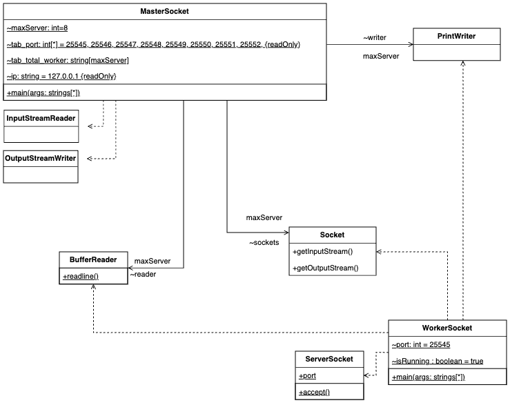

# Rapport Général - Partie 2

>[Retour au README](./README.md)

## Table des matières

- [Rapport Général - Partie 2](#rapport-général---partie-2)
  - [Table des matières](#table-des-matières)
  - [TP4 : Concepts avancés et Monte Carlo](#tp4--concepts-avancés-et-monte-carlo)
  - [Objectif](#objectif)
    - [Master / Worker](#master--worker)
    - [Future](#future)
    - [Accélération (Speedup)](#accélération-speedup)
    - [Scalabilité](#scalabilité)
    - [Work Stealing Pool](#work-stealing-pool)
    - [Application de l'API Concurrent](#application-de-lapi-concurrent)
    - [Méthode de Monte Carlo](#méthode-de-monte-carlo)
      - [Explication de la Parallélisation par Tâche](#explication-de-la-parallélisation-par-tâche)
      - [Exemple de Code Parallélisé](#exemple-de-code-parallélisé)
      - [Explication de la Parallélisation](#explication-de-la-parallélisation)
      - [Avantages de la Parallélisation par Tâche](#avantages-de-la-parallélisation-par-tâche)
      - [Conclusion](#conclusion)
    - [Analyse des performances de Monte Carlo](#analyse-des-performances-de-monte-carlo)
    - [Étude de la Scalabilité](#étude-de-la-scalabilité)
      - [Pi.java](#pijava)
      - [Assignments102](#assignments102)
    - [Comparaison Assignment102 vs Pi](#comparaison-assignment102-vs-pi)
      - [Différences d'erreurs](#différences-derreurs)
      - [Différences de paradigmes de programmation](#différences-de-paradigmes-de-programmation)
      - [Impact sur la Scalabilité](#impact-sur-la-scalabilité)
  - [Programmation distribuée](#programmation-distribuée)
    - [Master / Worker en distribué](#master--worker-en-distribué)
    - [Analyse des Sockets JAVA](#analyse-des-sockets-java)
    - [Monte Carlo Master/Worker Socket](#monte-carlo-masterworker-socket)
      - [Analyse MasterSocket.java](#analyse-mastersocketjava)
      - [Analyse WorkerSocket.java](#analyse-workersocketjava)
    - [Mise en place des mesures en architecture distribuée](#mise-en-place-des-mesures-en-architecture-distribuée)
  - [Qualité du code](#qualité-du-code)
    - [Quality in Use](#quality-in-use)
      - [1. Effectiveness (Efficacité)](#1-effectiveness-efficacité)
      - [2. Efficiency (Efficience)](#2-efficiency-efficience)
      - [3. Satisfaction](#3-satisfaction)
      - [4. Freedom from Risk (Réduction des risques)](#4-freedom-from-risk-réduction-des-risques)
      - [5. Context Coverage (Couverture du contexte)](#5-context-coverage-couverture-du-contexte)
    - [Product Quality](#product-quality)
      - [1. Fonctionnalité](#1-fonctionnalité)
      - [2. Fiabilité](#2-fiabilité)
      - [3. Performance et Efficience](#3-performance-et-efficience)
      - [4. Maintenabilité](#4-maintenabilité)
      - [5. Sécurité](#5-sécurité)
  - [Références et sources](#références-et-sources)

## TP4 : Concepts avancés et Monte Carlo

## Objectif
L'objectif de ce TP est d'explorer différentes approches pour calculer π en utilisant la méthode de Monte Carlo. En comparant les paradigmes de programmation de `Pi.java` et `Assignment102`, nous examinons les performances et l'efficacité de la programmation à mémoire partagée et distribuée. Cette étude vise à comprendre comment la parallélisation et la distribution des tâches peuvent optimiser les calculs intensifs, tout en mettant en avant les contraintes liées à la synchronisation et à la gestion des ressources.

### Master / Worker
Le modèle **Master/Worker** est une architecture de programmation parallèle où un **master** distribue des tâches à plusieurs **workers**. Le master coordonne les tâches et collecte les résultats, tandis que les workers exécutent les tâches en parallèle.

### Future
Un **Future** représente le résultat d'une opération asynchrone. Il permet de vérifier si le calcul est terminé et de récupérer le résultat une fois disponible.

### Accélération (Speedup)
L'**accélération** mesure le gain de performance obtenu en utilisant plusieurs processeurs par rapport à un seul. Elle est calculée comme le rapport entre le temps d'exécution séquentiel et le temps d'exécution parallèle.

### Scalabilité
La **scalabilité** est la capacité d'un système à augmenter ses performances proportionnellement à l'ajout de ressources (comme des processeurs). Elle peut être **forte** (augmentation linéaire) ou **faible** (augmentation sous-linéaire).

### Work Stealing Pool
Un **Work Stealing Pool** est une structure de données où les threads volent des tâches à d'autres threads lorsqu'ils sont inactifs, optimisant ainsi l'utilisation des ressources.

### Application de l'API Concurrent
L'API **Concurrent** de Java fournit des outils pour la programmation parallèle, comme les **Executors**, les **Futures**, et les **Concurrent Collections**, facilitant la gestion des threads et des tâches.

### Méthode de Monte Carlo
La méthode de **Monte Carlo** est une technique statistique utilisée pour estimer des résultats numériques en générant des échantillons aléatoires. Elle est souvent utilisée pour des simulations complexes.


La parallélisation par tâche est une technique utilisée pour améliorer les performances d'un programme en exécutant plusieurs tâches simultanément sur plusieurs processeurs ou cœurs. Dans le contexte de la méthode de Monte Carlo, la parallélisation par tâche peut être particulièrement efficace car cette méthode repose sur la génération d'un grand nombre d'échantillons aléatoires indépendants.

#### Explication de la Parallélisation par Tâche

1. **Décomposition en Tâches** :
   - **Tâche** : Une tâche est une unité de travail indépendante qui peut être exécutée séparément. Dans le cas de la méthode de Monte Carlo, chaque échantillon aléatoire ou groupe d'échantillons peut être considéré comme une tâche.
   - **Décomposition** : Le problème global est divisé en plusieurs tâches plus petites. Par exemple, si vous devez générer 1 000 000 d'échantillons, vous pouvez diviser ce travail en 10 tâches de 100 000 échantillons chacune.

2. **Exécution Parallèle** :
   - **Processeurs/Cœurs** : Chaque tâche est assignée à un processeur ou cœur différent pour être exécutée simultanément. Si vous avez 4 cœurs, vous pouvez exécuter 4 tâches en parallèle.
   - **Indépendance** : Les tâches doivent être indépendantes les unes des autres pour éviter les conflits d'accès aux ressources partagées. Dans la méthode de Monte Carlo, les échantillons sont généralement indépendants, ce qui facilite la parallélisation.

3. **Synchronisation et Agrégation** :
   - **Synchronisation** : Une fois que toutes les tâches sont terminées, les résultats doivent être synchronisés. Cela peut impliquer la collecte des résultats de chaque tâche et leur agrégation pour obtenir le résultat final.
   - **Agrégation** : Les résultats partiels des différentes tâches sont combinés pour obtenir le résultat global. Par exemple, si chaque tâche calcule une estimation partielle, ces estimations peuvent être moyennées pour obtenir l'estimation finale.

#### Exemple de Code Parallélisé

Voici un exemple de parallélisation par tâche pour le calcul de PI avec la méthode de Monte Carlo, utilisant l'API concurrent :

```python
import concurrent.futures
import random

def monte_carlo_task(num_samples):
    inside_circle = 0
    for _ in range(num_samples):
        x, y = random.random(), random.random()
        if x**2 + y**2 <= 1:
            inside_circle += 1
    return inside_circle

def monte_carlo_pi(num_samples, num_tasks):
    samples_per_task = num_samples // num_tasks
    with concurrent.futures.ProcessPoolExecutor() as executor:
        futures = [executor.submit(monte_carlo_task, samples_per_task) for _ in range(num_tasks)]
        inside_circle_counts = [future.result() for future in concurrent.futures.as_completed(futures)]
    total_inside_circle = sum(inside_circle_counts)
    return (total_inside_circle / num_samples) * 4
```

#### Explication de la Parallélisation
**Décomposition en Tâches :**
- La fonction `monte_carlo_task` représente une tâche individuelle. Elle prend un nombre d'échantillons (`num_samples`) et compte combien de ces échantillons tombent à l'intérieur d'un cercle unité.
- La fonction `monte_carlo_pi` divise le nombre total d'échantillons (`num_samples`) en plusieurs tâches (`num_tasks`). Chaque tâche traite un sous-ensemble des échantillons.

**Exécution Parallèle :**
- **ProcessPoolExecutor** : La bibliothèque `concurrent.futures` est utilisée pour créer un pool de processus (`ProcessPoolExecutor`). Cela permet d'exécuter plusieurs tâches en parallèle sur plusieurs processeurs ou cœurs.
- **submit** : La méthode `executor.submit` soumet chaque tâche (`monte_carlo_task`) au pool de processus. Chaque tâche est exécutée de manière indépendante et en parallèle.
- **futures** : Les objets `future` représentent les tâches en cours d'exécution. Ils permettent de récupérer les résultats une fois que les tâches sont terminées.

**Synchronisation et Agrégation :**
- **as_completed** : La méthode `concurrent.futures.as_completed` permet de récupérer les résultats des tâches au fur et à mesure qu'elles se terminent.
- **result** : La méthode `future.result()` récupère le résultat de chaque tâche. Les résultats sont ensuite agrégés pour obtenir le nombre total de points à l'intérieur du cercle.
- **Calcul Final** : Le résultat final est calculé en utilisant la formule de Monte Carlo pour estimer π.

#### Avantages de la Parallélisation par Tâche

- **Performance** : Réduit le temps d'exécution en utilisant plusieurs processeurs ou cœurs.
- **Scalabilité** : Peut être facilement adapté pour utiliser plus de ressources matérielles.
- **Simplicité** : Les tâches indépendantes sont plus faciles à gérer et à synchroniser.

#### Conclusion

La parallélisation par tâche est une technique puissante pour améliorer les performances des simulations de Monte Carlo en tirant parti des architectures multi-cœurs modernes. En décomposant le problème en tâches indépendantes et en les exécutant en parallèle, on peut obtenir des résultats plus rapidement et de manière plus efficace.

### Analyse des performances de Monte Carlo
La méthode de Monte Carlo peut bénéficier d'une bonne scalabilité grâce à son parallélisme naturel. Cependant, les limitations numériques et matérielles peuvent rapidement limiter les gains de performance.

### Étude de la Scalabilité

Pour étudier la scalabilité, nous avons choisi un nombre d'essais suffisamment grand pour mesurer le temps d'exécution de manière significative. Nous avons testé avec plusieurs workers et comparé les résultats. Dans ce cas il s'agissait de 12 millions d'opérations.

En raison de plusieurs contraintes, toutes les mesures souhaitées n'ont pas pu être réalisée comme prévue. Cependant il y en a assez pour illustrer les propos abordés dans cette partie.

#### Pi.java

Un script a été mis en place pour réaliser un graphique de la scalabilité forte de Pi.java, en modifiant le nombre de workers. Nous avons observé qu'au-delà de 8 cœurs, le speedup diminue en raison des limitations matérielles de la machine.

**Scalabilité forte sur une machine en G26**


**Scalabilité forte sur mon MacBook M1 pro**


**Scalabilité faible sur une machine en G26**


**Scalabilité faible sur mon MacBook M1 pro**


- **Parallélisation basée sur un pool de threads fixe :**
  Le programme utilise `Executors.newFixedThreadPool(numWorkers)` pour créer un pool de `numWorkers` threads, ce qui permet un contrôle efficace du parallélisme en limitant le nombre de threads actifs.

- **Répartition des tâches :**
  Chaque worker (`Callable<Long>`) exécute une fraction du nombre total d’itérations et renvoie un résultat partiel. L’agrégation des résultats se fait via `Future.get()`, qui agit comme une **barrière implicite** (les résultats sont collectés une fois que tous les threads ont terminé).

- **Avantages de cette approche :**
  - Les tâches sont bien équilibrées entre les threads (`totalCount / numWorkers` par worker).
  - L'utilisation de `invokeAll()` garantit que tous les threads travaillent en parallèle avant de récupérer les résultats.
  - Contrairement à `Assignment102.java`, le programme **réduit le nombre de tâches** en regroupant plusieurs itérations par worker, évitant ainsi la surcharge liée à la gestion d’un trop grand nombre de petites tâches.

- **Limites observées :**
  - Au-delà de 8 threads, le **speedup diminue** en raison de la saturation des ressources CPU et des coûts de synchronisation.
  - L’appel `Future.get()` bloque le thread principal jusqu'à ce que tous les workers aient terminé, ce qui peut créer un goulot d’étranglement si certains threads prennent plus de temps que d’autres.
  - L'utilisation de `Random` par chaque thread peut provoquer une contention si plusieurs threads génèrent des nombres aléatoires en parallèle.

#### Assignments102

Le script précédent a été réutilisé pour `Assignments102.java`. Ce paradigme fonctionne différemment et les mesures révèlent qu'il est moins efficace. Le speedup de la scalabilité forte du code `Assignments102` est proche de la scalabilité faible de `Pi.java`.

**Scalabilité forte sur mon MacBook M1 pro**


**Scalabilité faible attendue**


- **Trop de tâches créées (1 tâche par point simulé) :**
  Chaque simulation de point (x, y) est soumise individuellement au pool de threads, ce qui entraîne une surcharge importante sur le gestionnaire de tâches. La création et la gestion d'un grand nombre de threads très courts génèrent un overhead significatif et réduisent l'efficacité globale du programme.

- **Problème de synchronisation sur `AtomicInteger` :**
  L'utilisation de `AtomicInteger.incrementAndGet()` pour compter les points dans le cercle crée une contention mémoire entre threads. Chaque mise à jour étant atomique, cela ralentit l'accès concurrentiel. Une alternative plus performante serait l'utilisation de `LongAdder`, qui réduit les conflits en répartissant les mises à jour sur plusieurs variables internes.

Globalement, `Pi.java` est mieux parallélisé que `Assignment102.java`, car il minimise la surcharge de création de threads et utilise un **modèle de travail bien équilibré** pour exploiter efficacement les ressources CPU.

### Comparaison Assignment102 vs Pi

#### Différences d'erreurs

Malgrès le fait que je n'ai pas gardées mes mesures pour effectuer des graphiques voici ce que j'ai retenu des erreurs liées aux algorithmes:

L'erreur dans l'estimation de π varie en fonction de la méthode utilisée :
- **`Assignment102`** : Chaque point généré est traité individuellement, ce qui entraîne une grande variabilité due aux fluctuations aléatoires et aux conflits d'accès sur une variable partagée. La convergence est plus lente et l'erreur plus importante.
- **`Pi.java`** : La génération de points est répartie en lots et exécutée en parallèle, réduisant l'impact des erreurs aléatoires et améliorant la stabilité de l'estimation de π.

Cependant on remarque que les deux algorithmes montrent la même tendance générale et possèdent une fiabilité équivalente.

On remarque par ailleurs que l'erreur diminue systématiquement lorsque le nombre de points augmente.  

L'évolution des erreurs montre que les deux algorithmes convergent vers 1 / racine(N), typique de Monte Carlo : plus on ajoute de points, plus l'erreur se réduit, de plus en plus lentement.


#### Différences de paradigmes de programmation

1. **Approche `Assignment102` : Parallélisme de fine granularité**
   - Chaque point aléatoire est traité comme une tâche distincte.
   - Utilisation intensive de `AtomicInteger` pour la synchronisation, entraînant des ralentissements dus à la contention mémoire.
   - Nombre très élevé de tâches légères soumises à un gestionnaire de threads, augmentant la surcharge du système.

2. **Approche `Pi.java` : Parallélisme par regroupement de tâches**
   - Chaque thread traite un bloc d'échantillons, réduisant le nombre de tâches créées.
   - Synchronisation minimale grâce à l'agrégation locale avant soumission des résultats.
   - Utilisation optimisée des cœurs processeur avec un pool de threads équilibré.

#### Impact sur la Scalabilité
- **`Assignment102`** présente une scalabilité limitée en raison du nombre excessif de tâches et de la contention sur `AtomicInteger`.
- **`Pi.java`** est plus efficace car il minimise les conflits et optimise l'utilisation des ressources CPU.

Lors de la comparaison entre `Pi.java` et `Assignment102`, il est clair que `Pi.java` est plus efficace. `Pi.java` gère mieux les tâches et évite les conflits entre les différentes parties du programme. Pour des projets où il faut bien utiliser les ressources à disposition et obtenir des résultats précis. Cette méthode simplifie la gestion des tâches et assure une bonne coordination, ce qui est très utile quand les ressources sont limitées.  
En conclusion, la méthode `Pi.java` surpasse `Assignment102` en termes d'efficacité et de précision grâce à une meilleure gestion des tâches et une réduction des conflits d'accès concurrentiels. 

## Programmation distribuée

### Master / Worker en distribué
Dans un environnement distribué, le **master** envoie des messages aux **workers** via un réseau. Les workers exécutent les tâches en parallèle et renvoient les résultats au master.

### Analyse des Sockets JAVA



### Monte Carlo Master/Worker Socket

Pour calculer π et établir les communications Master/Worker, les changements suivants ont été apportés :
- Le **Master** distribue le nombre total de points à générer aux **Workers**.
- Chaque **Worker** génère des points aléatoires et compte ceux qui tombent dans un quart de cercle.
- Les résultats sont renvoyés au **Master**, qui les agrège pour estimer π.

#### Analyse MasterSocket.java

**Étapes principales dans le code**
**Initialisation des workers** :
- Le master demande combien de workers (processus) seront utilisés. Il ouvre un socket (canal de communication) pour chaque worker sur un port donné.
**Envoi des tâches aux workers** :
- Chaque worker reçoit le nombre total de points à générer pour l'estimation de 𝜋.

**Traitement par les workers** :
- Les workers génèrent des points aléatoires dans un carré, comptent ceux qui tombent dans un quart de cercle et renvoient leurs résultats au master.

**Récupération des résultats** :
- Le master collecte les résultats des workers via leurs sockets respectifs.
- Il combine ces résultats pour calculer la valeur approximative de 𝜋.

**Affichage des résultats** :
- Le master affiche 𝜋, l'erreur relative, et les statistiques de performance (durée, nombre de points, etc.).
- L'utilisateur peut choisir de répéter la simulation.

**Fermeture des sockets** :
- Une fois la simulation terminée, les sockets entre le master et les workers sont fermés proprement.

**Sockets :**
- **Socket côté master** : Utilisé pour envoyer des tâches et recevoir des résultats.
- **Socket côté worker (non montré ici)** : Écoute les messages du master, exécute la tâche, puis renvoie le résultat.

**Flux général de la communication**
**Master :**
- Connecte un socket pour chaque worker.
- Envoie une tâche à chaque worker via un flux d'écriture (PrintWriter).
- Lit les résultats des workers via un flux de lecture (BufferedReader).

**Workers (côté serveur, non montré ici) :**
- Écoute sur un port spécifique.
- Reçoit les données envoyées par le master.
- Effectue le calcul et renvoie le résultat.

#### Analyse WorkerSocket.java

**Étapes principales du code Worker**
**Configuration du Worker :**
- Le Worker démarre un serveur socket sur un port donné (par défaut 25545 ou spécifié en argument).
- Il attend une connexion entrante du Master via le socket.

**Communication avec le Master :**
- Une fois connecté, le Worker écoute les messages du Master en utilisant un flux d'entrée (BufferedReader).
- Après avoir reçu les données, il effectue le calcul nécessaire.

**Envoi des résultats au Master :**
- Le Worker utilise un flux de sortie (PrintWriter) pour renvoyer les résultats du calcul au Master.

**Gestion des messages et fin de tâche :**
- Si le message reçu est "END", le Worker arrête son exécution.
- Sinon, il continue à traiter les données envoyées par le Master.

**Flux de communication entre Master et Worker**
**Côté Master :**
- **Client socket :** Le Master initie la connexion et envoie des tâches aux Workers. Le Master attend les réponses des Workers pour agréger les résultats.

**Côté Worker :**
- **Serveur socket :** Le Worker accepte les connexions du Master. Chaque message reçu est interprété comme une instruction (par exemple, combien de points générer pour la méthode Monte Carlo). Une fois le calcul terminé, le résultat est renvoyé au Master.

### Mise en place des mesures en architecture distribuée

Pour mettre en place l'architecture distribuée nous devons mettre en communs les adresses IP des machines qui vont servir aux machines à communniquer.  

Ensuite il a fallut adapter le fichier Pi.java et le diviser en faisant un fichier par class afin de permettre une compilation sans erreurs.

**Calculs**  
Nous avons un Master qui envoie des requetes à une dizaine de worker.

Chaque worker est une machine indépendante et devra effectuée un total de 2 milliards d'opérations.

Nous utilisons Pi.java en scalabilité faible  pour acalculer un total de 64 milliards de points.

Pour un calcul de 2 milliard de points sur 16 machines avec 4 workers chacunes, nous arrivons à une moyenne de 70 secondes avec 16, 32 et 64 processeurs. On bserve donc une très bonne scalabilité forte.

---
## Qualité du code  
La qualité du code est un élément essentiel pour garantir la robustesse, la maintenabilité et l’efficacité d’un projet logiciel. 

La norme **ISO 25010** fait partie de la famille **SQuaRE (Software Quality Requirements and Evaluation)**, un ensemble de normes définissant des modèles de qualité pour les logiciels et les systèmes informatiques. Son objectif est d’aider à évaluer, améliorer et garantir la qualité des logiciels en fournissant des critères précis pour l’analyse des performances, de la fiabilité, de la sécurité et de l'expérience utilisateur.

Selon ces normes, la qualité d’un logiciel est évaluée selon plusieurs caractéristiques principales :

### Quality in Use  

La qualité en usage représente la manière dont le système répond aux attentes des utilisateurs finaux dans un contexte réel. Les critères suivants y sont évalués :  

#### 1. Effectiveness (Efficacité)  
L'application doit permettre aux utilisateurs d’atteindre leurs objectifs avec précision. Dans notre cas, l’algorithme de Monte Carlo implémenté doit fournir une estimation fiable de π, avec une marge d'erreur minimale. L’efficacité du programme est renforcée par l’utilisation d’une approche parallèle, réduisant ainsi le temps de traitement.  

#### 2. Efficiency (Efficience)  
Le programme exploite efficacement les ressources disponibles grâce à l'optimisation du parallélisme et à l'architecture Master/Worker. La distribution des calculs sur plusieurs threads et machines améliore significativement la rapidité d'exécution tout en optimisant l'utilisation du CPU et de la mémoire.  

#### 3. Satisfaction  
L'expérience utilisateur repose sur plusieurs éléments :  
- **Usefulness (Utilité)** : L’outil répond aux besoins spécifiques de calcul distribué en proposant une solution évolutive et adaptable.  
- **Trust (Confiance)** : La précision des résultats et la gestion des erreurs réseau garantissent une certaine fiabilité.  
- **Pleasure & Comfort (Plaisir & Confort)** : L’interface d’utilisation et la facilité de configuration influencent la satisfaction globale des utilisateurs.  

Dans notre cas, le code Assignements102 est bien moins satisfaisant que Pi en raison de son architecture réduisant ses performmances. Quand à la qualité des résultats et de l'interface, les codes sont similaires et ne procure pas de grandes satisfactions en raison d'un résultat approximatif de pi et d'une interface en ligne de commandes.

#### 4. Freedom from Risk (Réduction des risques)  
- **Economic risk mitigation (Atténuation des risques économiques)** : L'optimisation du code permet une meilleure utilisation des ressources matérielles, réduisant ainsi les coûts d’exploitation.  
- **Health & safety risk mitigation (Atténuation des risques de santé et sécurité)** : Le programme étant exécuté dans un environnement contrôlé, ces risques sont limités, sauf en cas de surcharge des ressources matérielles qui pourrait engendrer une instabilité du système.  
- **Environmental risk mitigation (Atténuation des risques environnementaux)** : En optimisant l'efficacité énergétique des calculs, l'application contribue à une réduction de la consommation électrique, particulièrement dans un contexte de calcul intensif.  

Nous n'avons aucun cas traité par notre code lié à cette partie.

#### 5. Context Coverage (Couverture du contexte)  
- **Context completeness (Exhaustivité du contexte)** : Le programme doit être capable de s’adapter à différentes architectures (monoposte, cluster, cloud).  
- **Flexibility (Flexibilité)** : L’algorithme peut être modifié et appliqué à d’autres types de simulations nécessitant du calcul distribué.  

Les deux codes sont flexibles et peuvent s'effecuter sur plusieurs architectures. Nous avons pu réalisés avec l'aide des Sockets une de la programmation à mémoire paratgée et à mémoire distribuée sur des machines avec des architectures différentes.

---

### Product Quality  

La qualité intrinsèque du produit est évaluée à travers les critères définis par **ISO 25010**, qui englobent les aspects structurels et fonctionnels du code.  

#### 1. Fonctionnalité  
- **Exactitude** : L’implémentation de Monte Carlo assure une précision correcte dans l'estimation de π, validée par des tests de comparaison.  
- **Interopérabilité** : La solution peut fonctionner sur différentes infrastructures matérielles et logicielles, ce qui facilite son intégration dans divers environnements.  

Nous avons pu observé une marge d'erreur minime sur les deux codes nous donnant une valeur approximative de pi à 10^-4^ près.

#### 2. Fiabilité  
- **Maturité** : Le programme a été testé sous plusieurs configurations, garantissant une certaine robustesse dans son exécution.  
- **Tolérance aux fautes** : La gestion des erreurs est essentielle pour assurer la continuité du traitement, notamment en cas de panne d’un worker. 

La fiabilité de Assignement102 est très limitée comparée à Pi qui gère beaucoup mieux les threads et à un code beaucoup plus optimisé. 

#### 3. Performance et Efficience  
- **Utilisation des ressources** : L’implémentation optimise l’utilisation du processeur grâce au parallélisme.  
- **Scalabilité** : Le programme peut être exécuté sur un grand nombre de threads et de machines sans perte significative de performances. 

Comme dit pour le point précédent, le code de Assignements102 limite énormément les capacités de la machines lui donnant une scalabilité forte nulle et une scalabitilité faible abominable. En revanche le code de Pi gère beaucoup mieux les ressources critiques et donc permet à la machine d'exploiter une très grande partie de ses ressources pour faire tourner le code.

#### 4. Maintenabilité  
- **Modularité** : La séparation des composants (`Master`, `Worker`, `Pi.java`) améliore la lisibilité et la réutilisabilité du code.  
- **Analyse et testabilité** : Des tests unitaires et de performance sont nécessaires pour garantir la stabilité de l’application.  

Malgrès un manque de test unitaires. Nous pouvons facilement réalisés des test d'acceptation et donc vérifier que les modifications apportées n'ont pas détruit le code.

#### 5. Sécurité  
- **Protection des données** : La communication entre Master et Workers via sockets nécessite des mécanismes de sécurisation pour éviter les interceptions et falsifications de données.

Les exprériences étant étaient réalisées sur des réseaux 'local' fermés. Il n'y a pas de problèmes de confidentialité.

---

## Références et sources

- Cours de Programmation Avancée, T. Dufaud.
- Cours de José Paumard.
- Code assignment102 :
  - Auteur : Karthik Jain (Software Developer, <https://www.krthkj.com>)
  - Source : <https://gist.github.com/krthkj/9c1868c1f69142c2952683ea91ca2a37>
- Code Pi :
  - Auteur : Dr. Steve Kautz, IOWA State University, <https://faculty.sites.iastate.edu/smkautz/>

- Technologies utilisées :
  - Java + bibliothèques natives - Langage de programmation
  - IntelliJ IDEA - Environnement de développement intégré
  - Visual Studio Code - Environnement de développement intégré
  - Git + GitHub - Gestion de versions et hébergement de code
  - StarUML, Draw.io - Modélisation UML
  - librairies python : matplotlib - Réalisation des graphismes